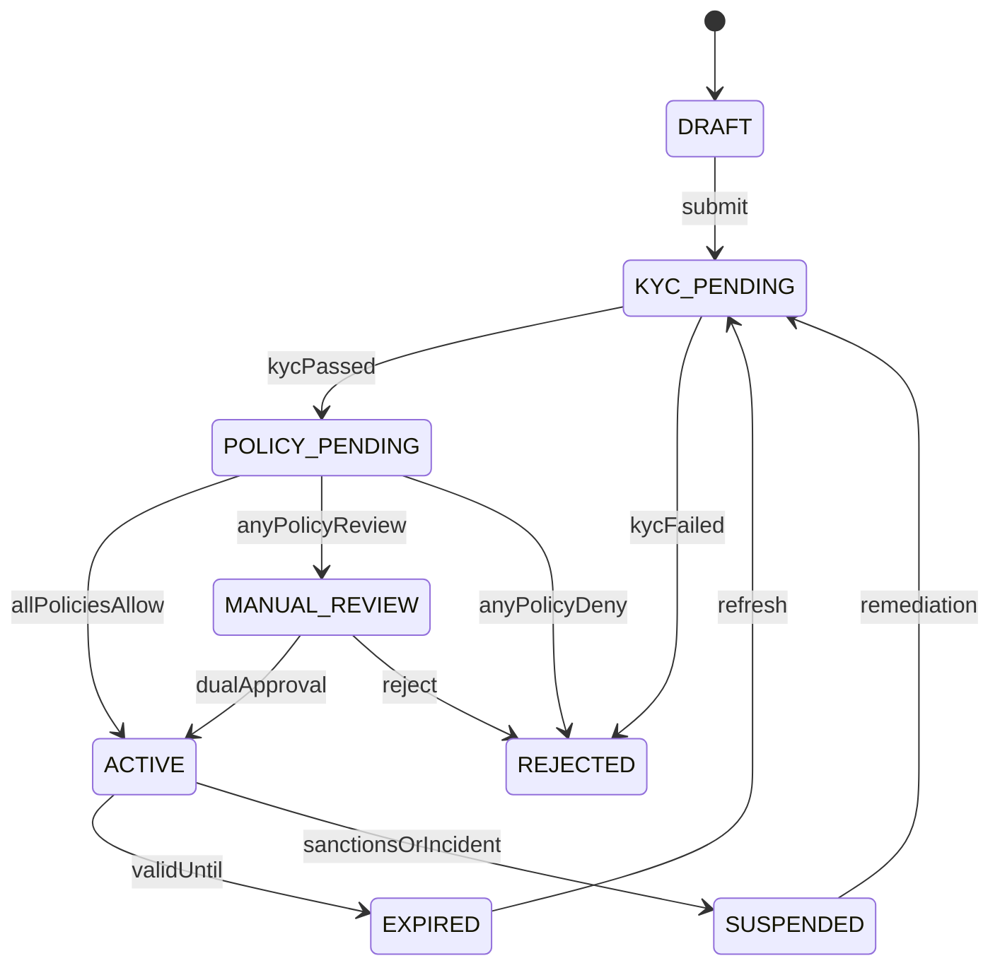
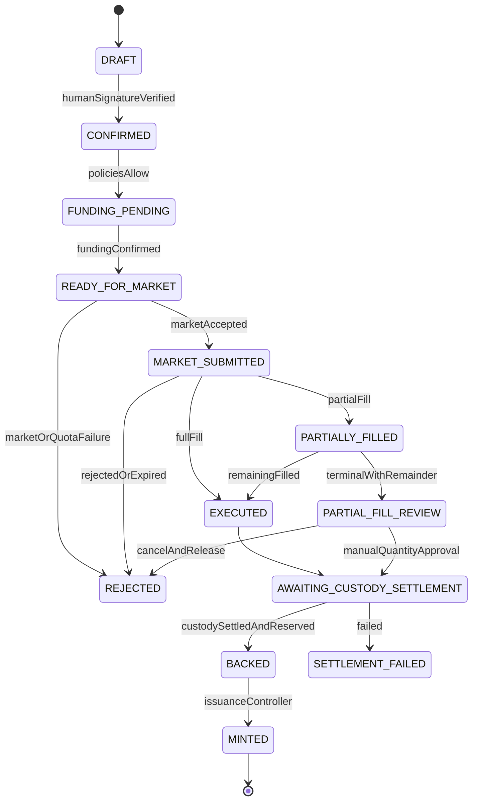

# 운영 모델과 라이프사이클

## 1. 참여자

| 역할 ID | 역할 | 권위 데이터 |
|---|---|---|
| `INVESTOR` | 해외 최종투자자 | 주문·거래의 인간 서명, 지갑 소유증명 |
| `FOREIGN_DISTRIBUTOR` | 해외 라이선스 판매·브로커 | KYC 결과, 현지 적격성, 공시동의, 최종투자자 권리장부·월별 보고 |
| `KR_BROKER_CUSTODIAN` | 국내 주문·결제·수탁 운영 | 외국인 통합계좌, KRX 주문·체결, KSD 결제, 옴니버스 수탁수량 |
| `SETTLEMENT_BANK` | 자금·FX·기관 결제현금 | 자금확인, 모의 예금토큰 발행·소각 |
| `COMPLIANCE_OPERATOR` | 정책과 예외심사 | 정책버전, 사유코드, manual-review 결정 |
| `TOKEN_OPERATOR` | 발행·환매 실행 | 유효한 준비금 증명에 종속된 명령 |
| `INDEPENDENT_CONTROL` | 2선 통제·재개 승인 | 공동승인, 대사·사고 판정 |
| `AUDITOR` | 읽기 전용 검증 | 감사결과와 증거조회 |

`KR_BROKER_CUSTODIAN`은 한 법인이 주문집행과 수탁 기능을 함께 제공할 수 있음을 반영한 외부 역할이다. 내부 capability는 `BROKERAGE_OPERATIONS`와 `CUSTODY_CONTROL`로 분리한다. 전자는 주문·체결·정정, 후자는 결제·수탁포지션·준비금 증거를 담당하며 서로 다른 principal과 기관키를 사용한다.

### 계좌·장부 권위

| 계층 | 계좌·장부 | 법적·운영 의미 | 시스템 표현 |
|---|---|---|---|
| 최종투자자 | 해외 유통사 entitlement account | 고객별 계약상 권리, 거래·배당·세무와 10년 보존의 권위기록 | `AccountLinkageView.entitlementAccountRef`와 entitlement position |
| 국내 시장 | foreign omnibus brokerage account | 해외 금융투자업자 명의의 법적 주문·현금·포지션 계좌 | `InstitutionalAccountView`의 `FOREIGN_OMNIBUS_BROKERAGE` |
| 국내 보관 | standing proxy custody reference | 상임대리인 보관계좌와 KSD 유래 결제·수탁 사실 | `STANDING_PROXY_CUSTODY` reference와 `CustodyPositionView` |
| 토큰 | verified wallet and permissioned ledger | 권리장부와 동기화된 제한적 이전 표현 | `AccountLinkageView.wallet`과 token position |
| 통제 | control residual account | 기업행동 반올림·정정 등 미배정 차이 | `CONTROL_RESIDUAL` activity와 position |

실계좌번호, 명의자 이름과 원본 고객정보는 shared payload에 넣지 않는다. 모든 참조는 `OpaqueId`이며, 각 권위장부의 책임기관과 마지막 대사시각을 함께 제공한다.

## 2. 책임분리

| 업무 | 실행 | 승인 | 증거 제공 | 조회 |
|---|---|---|---|---|
| KYC·현지 판매판정 | 해외 판매기관 | 컴플라이언스 | 해외 판매기관 | 국내기관·감사인 최소결과 |
| 최종투자자 권리·월별 보고 | 해외 판매기관 | 컴플라이언스 | 해외 권리장부·보고증거 | 국내 증권사·감사인 최소결과 |
| KRX 주문 | 국내 증권사 | 투자자 서명+정책결정 | KRX mock | 관련 기관·감사인 |
| KSD 결제 | KSD mock | 국내 증권·수탁기관 | KSD mock 서명 | 관련 기관·감사인 |
| 준비금 배정 | 국내 수탁기관 | 독립 통제 | 수탁 장부 참조 | 은행·토큰운영·감사인 |
| 토큰 발행 | 토큰 운영자 | 컨트랙트 불변식 | 결제+준비금 증명 | 전 참여기관 |
| 현금토큰 발행 | 은행 | 은행 통제 | 자금확인 | 거래당사자·감사인 |
| 정책 배포 | 컴플라이언스 | 독립 통제 | 정책 hash | 전 참여기관 |
| 강제이전·재개 | 지정 운영자 | 독립 통제 포함 2인 | 법적·사고 증거 | 감사인 |

한 개인 또는 한 서비스 계정은 준비금 승인과 토큰 발행, 정책 작성과 정책 승인, 사고조치와 재개승인을 동시에 가질 수 없다.

## 3. 명령과 상태 흐름

### 온보딩



### 1차 취득·발행



#### 체결과 결제 사이의 발행 게이트

Dinari 공개 문서는 Alpaca의 주문 체결 완료 통지 후 dShare를 발행하는 흐름을 제시한다. 공개 문서만으로 최종 증권결제 완료, 사전 확보 재고 또는 결제실패 위험의 부담 주체는 확인되지 않는다. 따라서 이 사례를 `EXECUTED -> MINTED` 전이의 근거로 사용하지 않는다.

본 PoC의 규범적 흐름은 `EXECUTED -> AWAITING_CUSTODY_SETTLEMENT -> BACKED -> MINTED`를 유지한다. KSD 결제 완료와 수탁 배정 증거가 없으면 발행할 수 없다.

`MarketExecution`은 주문 전체를 한 번에 완료시키는 레코드가 아니라 개별 fill이다. `OrderLifecycleView`가 주문수량, 누적체결, 미체결잔량과 `fills[]`를 계산한다. 정상 fixture는 전량체결을 사용한다. terminal partial fill은 `PARTIAL_FILL_REVIEW`로 보내고 미체결 자금을 해제하며, 담당자가 투자자 동의와 결제대상 수량을 확인하기 전에는 자동발행하지 않는다. correction·bust는 원 fill을 삭제하지 않고 `previousActivityId`로 연결한 반대 activity를 추가하며 결제·발행을 hold한다.

조기 발행은 core 옵션이나 feature flag로 두지 않는다. 향후 도입하려면 사전 확보 재고, 종목별 발행한도, 결제실패 손실흡수 주체, 미결제분 대사와 고객구제 절차를 포함한 별도 상품 버전과 승인을 요구한다.

### 2차 DvP

`PROPOSED -> POLICY_CHECKED -> DUAL_SIGNED -> CASH_LOCKED -> ATOMICALLY_SETTLED` 순서다. 만료·정책거절·잔액부족은 `REJECTED`, 실행 중 revert는 `FAILED`로 종료한다. `FAILED`와 `REJECTED`에서는 자산·현금 잔액이 시작 전과 같아야 한다.

### 현금배당

`ANNOUNCED -> RECORD_DATE_SNAPSHOTTED -> CASH_RECEIVED -> TAX_CALCULATED -> PAYOUT_READY -> PAID -> RECONCILED` 순서다. 실제 수령액과 지급계획이 맞지 않으면 `CORPORATE_ACTION_HOLD`로 이동한다.

### 환매

`REQUESTED -> POLICY_CHECKED -> TOKENS_LOCKED -> UNDERLYING_DISPOSITION_PENDING -> CASH_READY -> BURNED -> PAID -> RECONCILED` 순서다. 기초자산 처분 실패 시 토큰을 소각하지 않고 `REDEMPTION_REVIEW`에 둔다.

## 4. 정상 업무일

1. 시작 시 정책 버전, 기관 키, 종목상태, 시장일정과 전일 대사결과를 확인한다.
2. 주문 전 해외·한국 정책과 데이터 신선도를 평가한다.
3. 주문 중 모든 명령은 멱등성 키와 인간 서명, 활성 `AccountLinkageView`를 확인한다.
4. 시장 제출 후 개별 fill, 누적수량과 미체결수량을 기록한다. KRX 체결 후 결제 완료 전에는 미결제 주문으로 표시하고 발행하지 않는다.
5. KSD 결제와 준비금 배정 후 발행을 실행하고 즉시 수량 대사한다.
6. 2차 RFQ는 양 당사자 적격성과 양 자산 잔액을 사전검사한 뒤 원자적으로 결제한다.
7. 매 상태변경 후 증분 대사를 수행하고, 영업일 종료 시 전체 종목 대사를 수행한다.
8. 해외 판매기관은 최종투자자 월별 보고증거와 10년 보존기한을 갱신한다.
9. 일별 이벤트 Merkle root를 계산하되 퍼블릭 앵커 실패는 내부 업무를 중지시키지 않는다.

## 5. 어댑터 계약

### KRX mock adapter

- 입력: 확정 주문, 종목, 수량, 최대가격, 정책결정, 인간 서명
- 출력: `MarketOrderSubmitted`, 하나 이상의 `MarketFillRecorded`, `OrderExecuted` 또는 `OrderRejected`
- 검증: 시장상태, quote 유효기간, 기초재고 증가 시 foreign room
- 금지: 결제 완료 이벤트 생성

### KSD mock adapter

- 입력: 체결 ID와 시뮬레이션 시계
- 출력: `CustodySettlementCompleted` 또는 `CustodySettlementFailed`
- 검증: source sequence, 대상 fill 합계, 수량, 결제일, 중복·correction/bust 이벤트
- 금지: 토큰 발행 직접 호출

### Bank·FX mock adapter

- 입력: 주문 ID, 통화, 금액, FX quote와 만료시각
- 출력: `FundingConfirmed`, `FundingFailed`, `CashTokenIssued`
- 검증: 기관 정산계정과 금액 일치
- 금지: 투자자 적격성 승인

### Policy adapter

- 입력: 표준 `PolicyEvaluationRequest`
- 출력: 서명된 `PolicyDecision`
- 검증: `policyVersion`, `dataAsOf`, `validUntil`, action·instrument 범위
- 금지: PII를 공용 이벤트 payload에 포함

## 6. 대사

종목별 대사식은 다음과 같다.

```text
settledCustody
= unallocatedCustody + tokenizedBacking + redemptionPendingUnderlying

tokenizedBacking
= circulatingTokens + lockedTokens + settlementEscrowTokens

totalSupply
= circulatingTokens + lockedTokens + settlementEscrowTokens

sum(finalInvestorEntitlementPositions)
= totalSupply

grossCorporateActionReceipt
= investorGrossAllocations + controlResidual
```

상태 전이 중 일시적 차이는 같은 원자적 트랜잭션 또는 명시된 `inFlight` 항목으로만 허용한다. 허용되지 않은 차이가 1건이라도 생기면 신규 발행과 2차 결제를 중지한다.

복구 순서는 `DETECT -> HOLD -> COLLECT_EVIDENCE -> CLASSIFY -> CORRECT_SOURCE_OR_COMPENSATE -> FULL_RECONCILE -> DUAL_APPROVE -> RESUME`다. 이력 삭제나 기존 이벤트 수정은 금지하고 정정 이벤트를 추가한다.

## 7. 기업행동

PoC 필수 기업행동은 현금배당 하나다. 다음 항목을 모두 보여준다.

- 기준일과 ex-date를 혼동하지 않는 entitlement snapshot
- 옴니버스 총수령액과 투자자별 gross 배정
- 투자자별 세금결과의 오프체인 계산
- net payout과 rounding residual
- 미지급·실패 지급의 보류와 재처리
- 총수령액부터 지급완료까지의 대사
- 통합계좌 명의자에게 배정된 aggregate entitlement와 최종투자자별 allocation 연결
- 처리 미완료 시 해당 instrument의 신규 주문·이전 hold

의결권 자동전달은 `NOT_SUPPORTED_IN_CORE_POC`를 반환한다. 외국인 통합계좌에서 투자자별 의사가 다를 때 불통일 행사가 가능한 제도적 경로는 설명하되, 의사수집·발행회사 일정·증거전달이 구현되지 않았으므로 작동하는 것처럼 보이는 버튼을 만들지 않는다.

## 8. 읽기 모델과 화면 동기화

세 업무화면은 명령 DB를 직접 조합하지 않고 다음 read model을 사용한다.

- `AccountLinkageView`: participant, entitlement account, verified wallet, foreign distributor ledger, omnibus brokerage와 custody reference의 연결 및 authority
- `InstitutionalAccountView`: 법적 account type, owner institution, status, currency, capabilities와 opaque external reference
- `OrderLifecycleView`: order request, market order, fills, funding, settlement, reserve, issuance와 activities를 하나의 correlation 아래 정렬
- `CustodyPositionView`: settled, unsettled, allocated backing, unallocated, redemption pending, control hold
- `EntitlementPositionView`: 최종투자자별 total entitlement, available, locked, settlement escrow와 token-recorded quantity
- `AccountActivity`: fill, correction, bust, cash, FX, settlement, fee, dividend, adjustment와 reporting activity
- `CorporateActionAllocation`: aggregate receipt, investor gross, tax, fees, net, residual
- `RegulatoryReportingEvidence`: reporting period, generated/submitted timestamps, recipient, retentionUntil와 evidence ref

projection은 event의 stable source reference로 멱등 갱신한다. `sequence` gap, unknown account mapping 또는 서로 다른 source가 같은 external reference를 주장하면 해당 projection을 `STALE_OR_INCOMPLETE`로 표시하고 발행·2차결제에 사용하지 않는다.
