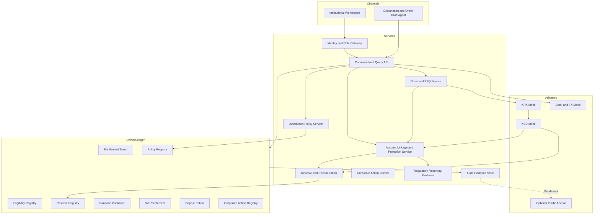

# 아키텍처·보안 통제

## 1. 논리 아키텍처

애플리케이션 언어·프레임워크는 고정하지 않는다. 구현은 OpenAPI·AsyncAPI·JSON Schema와 BDD를 만족하고 OCI 컨테이너 기반 로컬 실행을 제공해야 한다.

## 2. 신뢰 경계

| 경계 | 위협 | 필수 통제 |
|---|---|---|
| 투자자 브라우저 ↔ API | 주문변조, AI 자동제출, replay | EIP-712 인간서명, nonce, 만료, 표시내용 hash |
| 기관 서비스 ↔ API | 위조기관, 과도한 권한 | 로컬 OIDC JWT, role/audience 검증, production mTLS 확장점 |
| 해외 권리장부 ↔ account projection | 잘못된 계좌·지갑 연결, 중복 고객배정 | 1:1 active linkage, source authority, effective period, dual review for remap |
| 해외 entitlement position ↔ token record | 고객별 권리누락, lock·escrow 중복, stale projection | position component 합계, token-recorded quantity 비교, source sequence와 fail-closed hold |
| 어댑터 ↔ event bus | 데이터 위조, 중복·순서역전 | Ed25519 JWS, `kid`, sequence, idempotency, schema validation |
| 서비스 ↔ ledger | 관리자 오용, 잘못된 계약 | allowlisted service account, contract role 분리, simulation/preflight |
| PII vault ↔ policy service | 과수집, 누출 | 목적별 최소조회, tokenized reference, 접근감사, 응답 필드 allowlist |
| 보고 evidence ↔ 국내 증권사 | 최종투자자 기록 누락, 기한 미준수 | period·generatedAt·submittedAt·recipient·retentionUntil·evidence hash 검증 |
| internal ledger ↔ public anchor | 거래정보 노출 | 일별 Merkle root만 전송, anchor 장애 격리 |

PoC 사용자 서명은 secp256k1 EIP-712 typed data를 사용한다. 서명대상은 `orderId`, `participantId`, `instrumentId`, `side`, `quantity`, `limitPrice`, `currency`, `policyDecisionIds`, `termsVersion`, `nonce`, `expiresAt`이다. UI에 표시한 값과 typed data hash가 다르면 서명을 요청하지 않는다.

기관 이벤트 서명은 Ed25519 기반 detached JWS를 사용한다. 신뢰할 공개키는 로컬 기관 레지스트리에 `institutionId`, `kid`, `validFrom`, `validUntil`, `status`와 함께 등록한다. 키 폐기 후 과거 서명은 당시 유효성 기준으로 검증하고 신규 이벤트만 거부한다.

## 3. 원장 모듈 책임

### `EntitlementToken`

- 종목별 하나의 fungible contract, `decimals=0`
- 일반 이전은 `EligibilityRegistry`와 정책결정 유효성 확인
- ERC-7943 호환 가능성 조회, 동결, 강제이전
- mint·burn은 `IssuanceController`만 호출
- pause는 `EMERGENCY_OPERATOR` 요청과 `INDEPENDENT_CONTROL` 공동승인

### `EligibilityRegistry`

- wallet과 opaque participant ID 연결
- action별 적격상태와 만료시각 저장
- 원본 claim·PII 저장 금지
- 변경 시 이전 결정 참조와 서명자 기록

`EligibilityRegistry`의 wallet 연결은 `AccountLinkageView`의 `ACTIVE` 상태와 함께 검증한다. 하나의 active wallet을 둘 이상의 participant 또는 entitlement account에 연결할 수 없다. wallet 교체는 기존 지갑 동결, 신규 소유증명, 해외 유통사와 independent control의 승인, 전·후 linkage hash 기록을 요구한다.

### `PolicyRegistry`

- `policyId`, `version`, `contentHash`, `effectiveFrom`, `effectiveUntil`, 승인기관 저장
- `JurisdictionPolicy` 로직 원문은 오프체인
- 거래가 소비한 결정은 삭제하지 않고 revoked 상태와 사유만 추가

### `ReserveRegistry`

- `settledCustody`, `tokenizedBacking`, `asOf`, evidence hash 저장
- 수탁기관과 독립 통제의 공동 승인
- 수량 감소가 공급량 아래로 내려가는 업데이트 거절

### `IssuanceController`

- 주문·결제·준비금 증거의 미사용 여부 확인
- `newSupply <= tokenizedBacking <= settledCustody` 확인
- 성공 시 증거를 consumed로 표시하고 같은 트랜잭션에서 mint
- 환매 burn과 준비금 해제 순서는 운영 상태기계에 종속

### `DvPSettlement`

- 양 당사자 EIP-712 서명과 정책결정 검증
- 거래 ID·nonce 재사용 금지
- 자산·현금 가용잔액 및 동결상태 확인
- 한 트랜잭션에서 두 transfer 실행, 하나 실패 시 revert

### `DepositToken`

- PoC 기관 정산용 모의 KRW, 1 unit = 1 mock KRW
- 은행 역할만 발행·소각, 임의 일반전송 금지
- 실제 예금·현금·CBDC라는 오해를 막는 `DEMO_ONLY` metadata

### `CorporateActionRegistry`

- 발표, 기준일 snapshot hash, gross receipt, tax allocation hash, payout, reconciliation 상태
- 개인정보와 개별 세무근거는 오프체인

## 4. 데이터 분류

| 등급 | 예 | 저장 위치 | 공용 이벤트 |
|---|---|---|---|
| Restricted PII | 이름, 여권, 주소, 생년월일, 세금번호 | 기관별 암호화 PII vault | 금지 |
| Confidential evidence | KYC 보고서, 제재검색 상세, 법률검토 | 책임기관 evidence store | opaque ref+hash만 |
| Consortium operational | opaque 계좌참조, 주문, fill·activity, 수량, 정책결정, 준비금, 대사·보고 메타데이터 | 서비스 DB와 허가형 원장 | 역할별 최소공개 |
| Public anchor | 일별 이벤트 root, schema version | 선택적 테스트넷 | 허용 |
| Demo synthetic | 가상 인물·가격·room | fixture | `DEMO_ONLY` 표시 후 허용 |

금지 필드 목록은 `name`, `fullName`, `passport`, `passportHash`, `residentNumber`, `taxId`, `birthDate`, `homeAddress`, `email`, `phone` 및 대소문자·snake/camel 변형이다. CI와 런타임 로그 검사에서 이 키가 공용 payload에 발견되면 실패 처리한다.

PII 비기록은 최종투자자 기록의 부재를 의미하지 않는다. 해외 유통사는 원본 거래·고객기록을 규제상 기간 동안 보존하고, shared system에는 보고기간, 제출상태, 수신기관, `retentionUntil`과 `EvidenceRef`만 제공한다. 보고 evidence의 `classification`은 `CONFIDENTIAL` 또는 `RESTRICTED_PII`이며 본문은 권한 없는 화면에서 조회할 수 없다.

## 5. 가용성과 장애 처리

- validator 한 대가 중지돼도 합의 정족수가 유지되는 구성에서 읽기·쓰기 수명주기가 계속돼야 한다.
- event bus 또는 adapter가 지연되면 추정값으로 진행하지 않고 해당 상태에서 대기한다.
- account/activity projection의 cursor가 끊기거나 source sequence gap이 있으면 화면을 stale로 표시하고 신규 mint와 해당 account의 이전을 중지한다.
- public anchor 실패는 warning이며 내부 원장 거래를 중지시키지 않는다.
- policy service 장애 시 신규 위험행동은 fail closed, 기존 조회와 감사는 계속한다.
- reconciliation service 장애 시 신규 mint를 중지하고 이미 제출된 atomic DvP는 ledger의 사전조건에 따라 처리한다.
- clock skew 허용값은 로컬 PoC에서 30초이며 그 이상인 기관 이벤트는 `EVENT_CLOCK_SKEW`로 거절한다.

## 6. 보안 이벤트와 감사

모든 privileged action은 요청자, 승인자, role, 사유코드, evidence ref, 전·후 상태 hash를 포함한 `AuditEvent`를 만든다. 다음 이벤트는 high priority다.

- 정책 배포·폐기
- 준비금 증가·감소
- mint·burn
- 동결·해제·강제이전
- 비상정지·재개
- 기관키 등록·폐기
- 대사 불일치·정정
- account linkage 생성·변경·해제
- market fill correction·bust와 cash·position adjustment
- 월별 최종투자자 보고 생성·제출·기한초과
- manual review 승인·거절

감사 타임라인은 원본 비밀정보를 노출하지 않으면서 거래 ID 하나로 모든 선행 결정과 후속 결과를 조회할 수 있어야 한다.

## 7. 업그레이드와 구성

PoC 계약 업그레이드는 기능 시연 범위에서만 UUPS 패턴을 사용할 수 있다. 업그레이드에는 제안·독립 검토·timelock·2인 승인을 요구하고 저장 레이아웃 검사를 통과해야 한다. 상품 수량·정책값·기관키를 코드 상수로 넣지 않는다.

구성값은 환경별로 분리하되 fixture의 `legalStatus`, `dataClassification`, `source`, `dataAsOf`는 환경변수로 제거할 수 없게 한다. production 프로파일은 이 저장소 범위 밖이며 제공하지 않는다.
