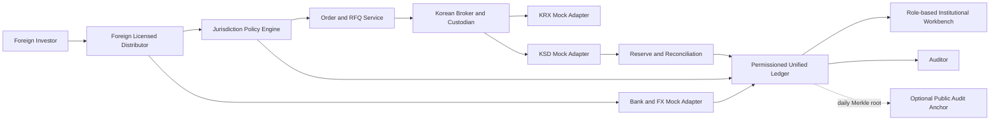

# 설계 결정 요약

이 문서는 프로젝트의 규범적 결정과 문서 우선순위를 정의한다. 세부 설명은 `design/`, 실행 가능한 계약은 `specs/`에 있다.

## 문서 우선순위

충돌 시 다음 순서를 따른다.

1. `specs/schemas/`의 데이터 제약과 `specs/bdd/`의 합격 조건
2. `specs/openapi.yaml`, `specs/asyncapi.yaml`, 상태기계와 불변식
3. `design/`의 운영·법률·아키텍처 설명
4. 기관 검토용 최종 후보 보고서
5. `tmp/`의 기존 조사와 워크스루

`MUST`, `MUST NOT`, `SHOULD`, `MAY`는 각각 필수, 금지, 권고, 선택을 뜻한다. PoC 구현 에이전트는 MUST/MUST NOT을 변경할 수 없다.

## 목표 결과

직접계좌, 외국인 통합계좌, 해외 DR과 간접노출을 비교한 뒤 1단계 기준경로로 선택한 외국인 통합계좌의 주문·수탁 구조를 유지하면서 다음을 검증한다.

- 해외 판매기관의 관할별 적격성 결과와 한국 자산정책을 하나의 주문에 결합한다.
- 결제 완료 수탁분을 초과하는 권리토큰 발행을 차단한다.
- 적격 참여자 간 2차 권리 이전을 동일 원장의 모의 원화 현금과 원자적으로 결제한다.
- 배당·환매·대사·사고복구까지 기관별 책임과 증거를 추적한다.
- 홍콩 프로파일을 제거하거나 다른 프로파일로 바꿔도 코어 도메인과 컨트랙트가 변하지 않는다.

## 확정 결정

| ID | 결정 | 이유 | 금지되는 해석 |
|---|---|---|---|
| D-001 | 1단계 상품은 제3자 수탁 권리 토큰 | 현재 인프라에 인접한 통제 PoC | 직접 주식, 전자등록주식, 발행사 보증으로 표시 금지 |
| D-002 | 1토큰은 결제 완료 주식 1주 권리, `decimals=0` | 권리·준비금 대사를 단순하고 명확하게 유지 | 부분주와 무담보 합성노출 금지 |
| D-003 | 단일 허가형 EVM/Besu 호환 원장 | DvP를 단일 트랜잭션으로 검증 | CCIP·브리지·퍼블릭 체인을 핵심 결제로 사용 금지 |
| D-004 | 현금은 모의 원화 예금토큰 | 기관 결제 원자성을 검증 | 외국인 개인의 실제 한국 예금청구권으로 표시 금지 |
| D-005 | 관할규칙은 `JurisdictionPolicy`로 분리 | 국가 추가·변경 때 코어 안정성 확보 | 홍콩 조건을 토큰 계약에 하드코딩 금지 |
| D-006 | 홍콩은 첫 참조 판매 프로파일 | 실제 하나–Emperor 경로와 SFC 통제 활용 | 유일한 목표시장 또는 특별대우로 표현 금지 |
| D-007 | 1차 매입은 KRX 시장·T+2 외부결제 | 기초주식 운영현실 보존 | 1차 매입의 즉시결제·24/7 유동성 주장 금지 |
| D-008 | 2차 거래는 permissioned RFQ | 유동성 과장 없이 통제된 DvP 검증 | AMM·무허가 전송 금지 |
| D-009 | AI는 설명·주문초안만 생성 | 인간의 의사결정과 키 통제 보장 | AI 서명·자동제출·자율체결 금지 |
| D-010 | PII와 PII 해시는 공용 원장에서 제외 | 삭제불가·연결가능성·목적외 이용 위험 축소 | 여권번호·이름·주소·세금번호의 기록 금지 |
| D-011 | 불일치는 `RECONCILIATION_HOLD` | 오류 확대보다 안전한 중지 우선 | 대사 불일치 상태에서 발행·2차결제 금지 |
| D-012 | 2단계는 발행인 참여형 별도 승인 | 2027년 제도화와 단계적 인프라 준비 반영 | 1단계 계약을 자동 업그레이드 금지 |
| D-013 | Dinari는 수탁형 비교사례이며 구현 의존성이 아님 | 공개된 중개·수탁·발행 흐름에서 제도적 교훈을 추출 | Dinari 연동, 미국 구조의 복제 또는 상품 동등성 주장 금지 |
| D-014 | 통합계좌는 여러 접근경로 중 선택한 1단계 기준 인프라 | 최종투자자별 국내계좌 없이 다수 KRX 종목의 결제 완료 재고와 해외 권리를 연결하는 수탁형 PoC에 가장 적합 | 통합계좌를 외국인의 유일한 접근경로로 표시하거나 직접계좌·DR보다 항상 우월하다고 주장 금지 |

## 시스템 경계



`KRX`, `KSD`, 은행·FX의 실제 시스템은 PoC 경계 밖이다. mock adapter는 실기관 연결처럼 보이는 UI를 사용해서는 안 되며 모든 합성 데이터에 `DEMO_ONLY`를 표시한다.

## 핵심 불변식

```text
totalSupply(instrument) = tokenizedBacking(instrument)
tokenizedBacking(instrument) <= settledCustody(instrument)
DvP = assetMoved AND cashMoved, or NOT assetMoved AND NOT cashMoved
confirmedOrder => humanSignatureVerified = true
mint => custodySettlement.consumed = true AND reserveAttestation.consumed = true
reconciliationMismatch => issuancePaused = true AND secondarySettlementPaused = true
```

외국인 시장 총보유량은 기초주식 재고가 증가하는 주문에서 검사한다. 외국인 간 이미 발행된 권리토큰 이전에서는 총량을 다시 차감하지 않고 투자자별·관할별 제한만 검사한다.

## 구현 완료의 정의

설계 패키지는 다음 조건을 모두 만족할 때 PoC 구현 입력으로 사용할 수 있다.

- 모든 API와 이벤트 payload가 JSON Schema를 통과한다.
- 모든 명령·이벤트·상태·오류가 추적성 매트릭스에 연결된다.
- 정상 수명주기와 필수 실패 시나리오가 BDD로 정의된다.
- 역할별 허용·금지 동작과 2인 승인 경계가 명시된다.
- 법적 미확정 사항이 시스템의 config와 manual-review gate로 격리된다.
- 구현 스택을 바꾸더라도 외부 계약, 불변식과 합격 조건이 유지된다.
