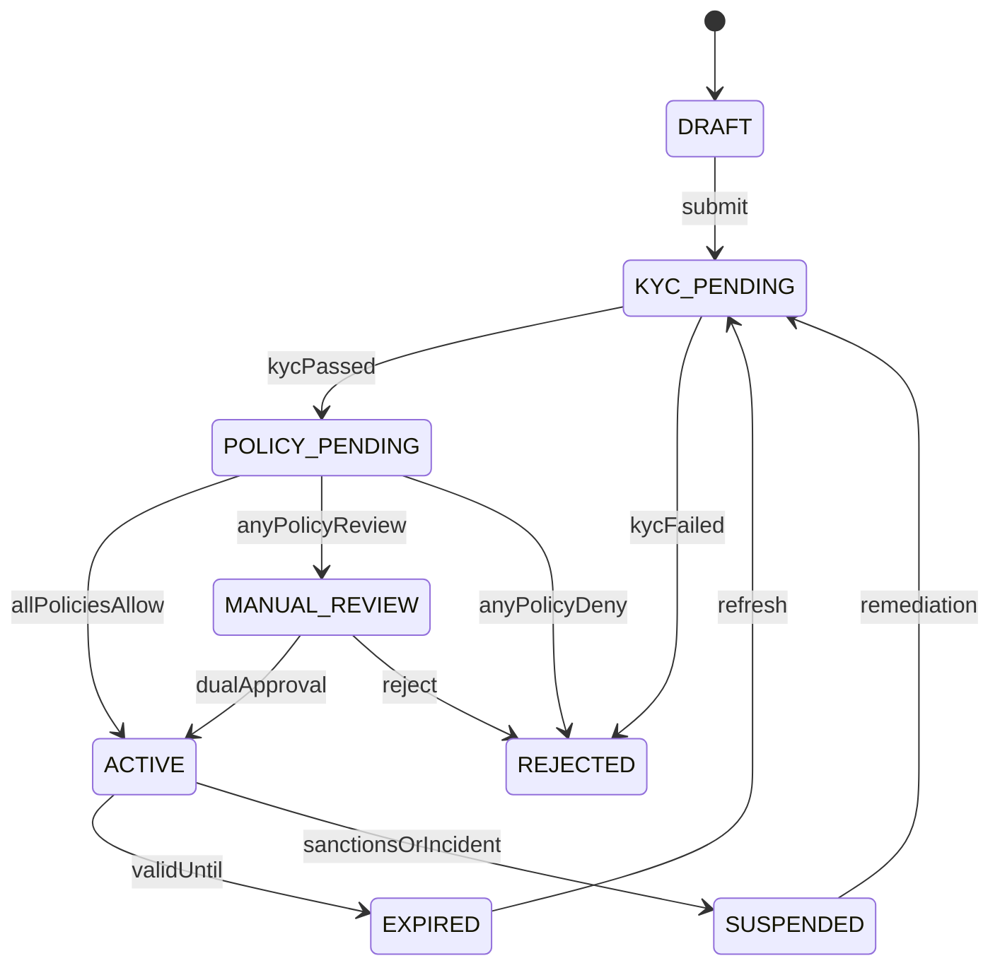
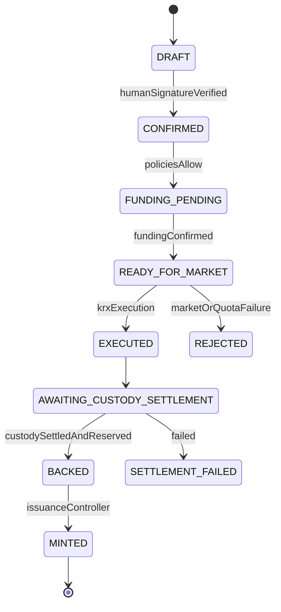

# 운영 모델과 라이프사이클

## 1. 참여자

| 역할 ID | 역할 | 권위 데이터 |
|---|---|---|
| `INVESTOR` | 해외 최종투자자 | 주문·거래의 인간 서명, 지갑 소유증명 |
| `FOREIGN_DISTRIBUTOR` | 해외 라이선스 판매·브로커 | KYC 결과, 현지 적격성, 공시동의 |
| `KR_BROKER_CUSTODIAN` | 국내 주문·결제·수탁 운영 | KRX 주문, KSD 결제, 옴니버스 수탁수량 |
| `SETTLEMENT_BANK` | 자금·FX·기관 결제현금 | 자금확인, 모의 예금토큰 발행·소각 |
| `COMPLIANCE_OPERATOR` | 정책과 예외심사 | 정책버전, 사유코드, manual-review 결정 |
| `TOKEN_OPERATOR` | 발행·환매 실행 | 유효한 준비금 증명에 종속된 명령 |
| `INDEPENDENT_CONTROL` | 2선 통제·재개 승인 | 공동승인, 대사·사고 판정 |
| `AUDITOR` | 읽기 전용 검증 | 감사결과와 증거조회 |

## 2. 책임분리

| 업무 | 실행 | 승인 | 증거 제공 | 조회 |
|---|---|---|---|---|
| KYC·현지 판매판정 | 해외 판매기관 | 컴플라이언스 | 해외 판매기관 | 국내기관·감사인 최소결과 |
| KRX 주문 | 국내 증권사 | 투자자 서명+정책결정 | KRX mock | 관련 기관·감사인 |
| KSD 결제 | KSD mock | 국내 증권·수탁기관 | KSD mock 서명 | 관련 기관·감사인 |
| 준비금 배정 | 국내 수탁기관 | 독립 통제 | 수탁 장부 참조 | 은행·토큰운영·감사인 |
| 토큰 발행 | 토큰 운영자 | 컨트랙트 불변식 | 결제+준비금 증명 | 전 참여기관 |
| 현금토큰 발행 | 은행 | 은행 통제 | 자금확인 | 거래당사자·감사인 |
| 정책 배포 | 컴플라이언스 | 독립 통제 | 정책 hash | 전 참여기관 |
| 강제이전·재개 | 지정 운영자 | 독립 통제 포함 2인 | 법적·사고 증거 | 감사인 |

한 개인 또는 한 서비스 계정은 준비금 승인과 토큰 발행, 정책 작성과 정책 승인, 사고조치와 재개승인을 동시에 가질 수 없다.

## 3. 명령과 상태 흐름

### 온보딩



### 1차 취득·발행



### 2차 DvP

`PROPOSED -> POLICY_CHECKED -> DUAL_SIGNED -> CASH_LOCKED -> ATOMICALLY_SETTLED` 순서다. 만료·정책거절·잔액부족은 `REJECTED`, 실행 중 revert는 `FAILED`로 종료한다. `FAILED`와 `REJECTED`에서는 자산·현금 잔액이 시작 전과 같아야 한다.

### 현금배당

`ANNOUNCED -> RECORD_DATE_SNAPSHOTTED -> CASH_RECEIVED -> TAX_CALCULATED -> PAYOUT_READY -> PAID -> RECONCILED` 순서다. 실제 수령액과 지급계획이 맞지 않으면 `CORPORATE_ACTION_HOLD`로 이동한다.

### 환매

`REQUESTED -> POLICY_CHECKED -> TOKENS_LOCKED -> UNDERLYING_DISPOSITION_PENDING -> CASH_READY -> BURNED -> PAID -> RECONCILED` 순서다. 기초자산 처분 실패 시 토큰을 소각하지 않고 `REDEMPTION_REVIEW`에 둔다.

## 4. 정상 업무일

1. 시작 시 정책 버전, 기관 키, 종목상태, 시장일정과 전일 대사결과를 확인한다.
2. 주문 전 해외·한국 정책과 데이터 신선도를 평가한다.
3. 주문 중 모든 명령은 멱등성 키와 인간 서명을 확인한다.
4. KRX 체결 후 결제 완료 전에는 미결제 주문으로 표시하고 발행하지 않는다.
5. KSD 결제와 준비금 배정 후 발행을 실행하고 즉시 수량 대사한다.
6. 2차 RFQ는 양 당사자 적격성과 양 자산 잔액을 사전검사한 뒤 원자적으로 결제한다.
7. 매 상태변경 후 증분 대사를 수행하고, 영업일 종료 시 전체 종목 대사를 수행한다.
8. 일별 이벤트 Merkle root를 계산하되 퍼블릭 앵커 실패는 내부 업무를 중지시키지 않는다.

## 5. 어댑터 계약

### KRX mock adapter

- 입력: 확정 주문, 종목, 수량, 최대가격, 정책결정, 인간 서명
- 출력: `OrderExecuted` 또는 `OrderRejected`
- 검증: 시장상태, quote 유효기간, 기초재고 증가 시 foreign room
- 금지: 결제 완료 이벤트 생성

### KSD mock adapter

- 입력: 체결 ID와 시뮬레이션 시계
- 출력: `CustodySettlementCompleted` 또는 `CustodySettlementFailed`
- 검증: source sequence, 수량, 결제일, 중복 이벤트
- 금지: 토큰 발행 직접 호출

### Bank·FX mock adapter

- 입력: 주문 ID, 통화, 금액, FX quote와 만료시각
- 출력: `FundingConfirmed`, `FundingFailed`, `CashTokenIssued`
- 검증: 기관 정산계정과 금액 일치
- 금지: 투자자 적격성 승인

### Policy adapter

- 입력: 표준 `PolicyEvaluationRequest`
- 출력: 서명된 `PolicyDecision`
- 검증: `policyVersion`, `dataAsOf`, `validUntil`, action·instrument 범위
- 금지: PII를 공용 이벤트 payload에 포함

## 6. 대사

종목별 대사식은 다음과 같다.

```text
settledCustody
= unallocatedCustody + tokenizedBacking + redemptionPendingUnderlying

tokenizedBacking
= circulatingTokens + lockedTokens + settlementEscrowTokens

totalSupply
= circulatingTokens + lockedTokens + settlementEscrowTokens
```

상태 전이 중 일시적 차이는 같은 원자적 트랜잭션 또는 명시된 `inFlight` 항목으로만 허용한다. 허용되지 않은 차이가 1건이라도 생기면 신규 발행과 2차 결제를 중지한다.

복구 순서는 `DETECT -> HOLD -> COLLECT_EVIDENCE -> CLASSIFY -> CORRECT_SOURCE_OR_COMPENSATE -> FULL_RECONCILE -> DUAL_APPROVE -> RESUME`다. 이력 삭제나 기존 이벤트 수정은 금지하고 정정 이벤트를 추가한다.

## 7. 기업행동

PoC 필수 기업행동은 현금배당 하나다. 다음 항목을 모두 보여준다.

- 기준일과 ex-date를 혼동하지 않는 entitlement snapshot
- 옴니버스 총수령액과 투자자별 gross 배정
- 투자자별 세금결과의 오프체인 계산
- net payout과 rounding residual
- 미지급·실패 지급의 보류와 재처리
- 총수령액부터 지급완료까지의 대사

의결권은 `NOT_SUPPORTED_IN_CORE_POC`를 반환한다. 화면에서는 후속범위로 설명하되 작동하는 것처럼 보이는 버튼을 만들지 않는다.
